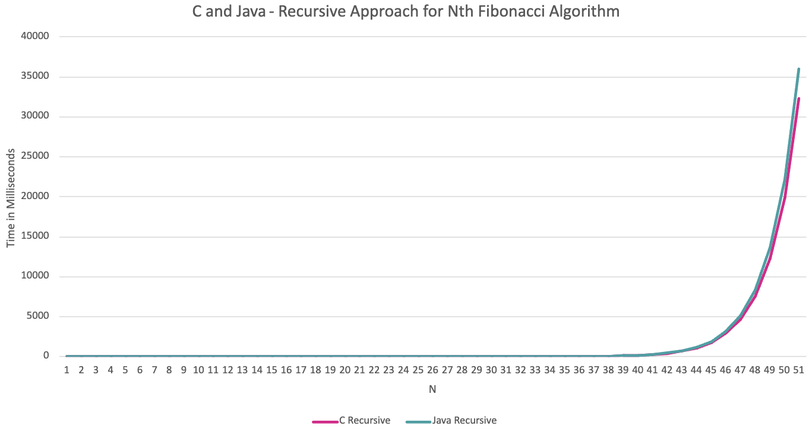
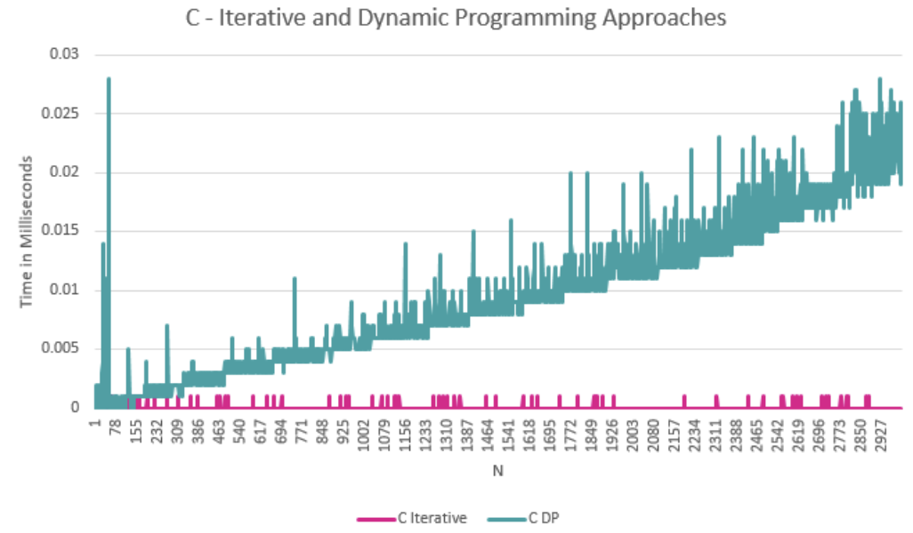
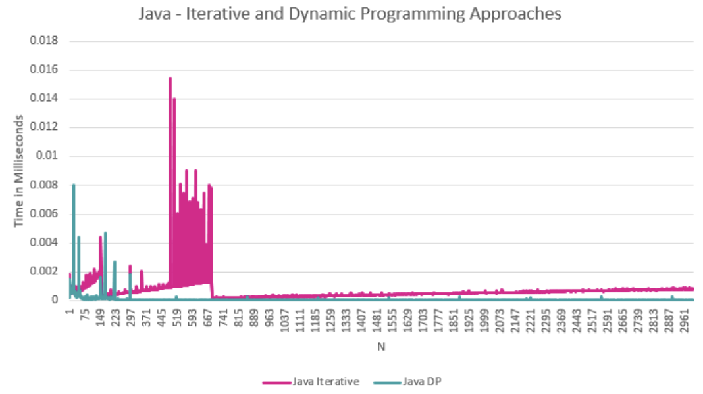

# Midterm p1: Report on Analysis of Fibonacci Algorithm
* **Author**: Aliya Salmanova
* **Semester** Fall 2025
* **Languages Used**: C, Java

## Introduction

For this report, I solved the Nth fibonacci algorithm iteratively, recursively, and with dynamic programming
in C and in Java. The fibonacci sequence is a sequence where every element is the sum of the previous two
elements, so F(0) = 0, F(1) = 1, and F(n) = F(n - 1) + F(n - 2). All my C source code is in src_c and Java source code
is in src_java. The main.c and Main.java files prompt the user for N, and compute the Nth fibonacci
using the 3 approaches. The runner.c and Runner.java files print all the runtimes and ops
for 0...N to csv files, and I used this data to create line graphs that are in the png_folder.

## Overview and Big O Notation

| Fibonacci Algorithm | Iterative | Recursive | Dynamic Programming |
|---------------------|-----------|----------|---------------------|
| Time Complexity     | O(n)      | O(2^n)   | O(n)                |
| Space Complexity    | O(1)      | O(n)     | O(n)                |


### Iterative approach

Pseudocode:
```
function fib_iter(n):
    if n <= 1: return n
    prev = 0
    curr = 1
    for i from 2 to n:
        temp = prev + curr
        prev = curr
        curr = temp
    return prev
```

Time complexity: the T(n) for this algorithm is a(n) + c, as we initially have two constants,
and then have a loop that loops until n. Inside the loop, we have some updates.
In Big O notation, we don't count constants, so we get O(n).


The space complexity is O(1), as no matter how large or small n is, we always declare the same number of variables.

### Recursive approach

Pseudocode:

```
function fib_rec(n):
    if n <= 1: return n
    return fib_rec(n-1) + fib_rec(n-2)
```

Let's look at this using the recurrence tree if n is 4:

n
\
(n-1) (n-2) \
(2^1)
\
(n-2) (n-3) (n-3) (n-4) \
(2^2)
\
(n-3) \
(2^3)

The T(n) for the average and worse case is T(n-1) + T(n-2) + O(1).
We ignore constants, so the big O notation is O(2^n), which is exponential growth.

Our space complexity would be O(n). This is because the space complexity of a recursive algorithm
is the space for the data structures used + the depth of the recursion.
If we count how many calls are on the call stack, we see that the amount of calls on the call
stack never goes over n.
In the case of n = 4, we would get fib(4), fib(3), fib(2), fib(1) on the call stack.
After that, fib(1) gets popped off and fib(0) gets added.
We never go over 4 functions on the call stack.

### Dynamic programming approach:

Pseudocode:

```
memo = array of length n+1 filled with 0s
function fib_memo(n):
    if n <= 1: return n
    if memo[n] != 0: return memo[n]
    memo[n] = fib_memo(n-1) + fib_memo(n-2)
    return memo[n]
```

To show what is happening better I will draw out a tree:
_______________fib(4) \
____________fib(3) fib(2) - returns \
______fib(2) fib(1) - returns \
fib(1) fib(0) \

Using memoization, we compute each subproblem once.
The first time we hit an n, we do O(1) work (a couple checks and an add) and store it.
Later calls are O(1) cache hits that just return the saved value.
Since there are n distinct states, the total work is linear, so the big O notation is O(n).
T(n) = a·n + c = Θ(n).
The constant term includes the cache hits.

It also could take O(n) to initialize the array of 0s, depending on the language and what we use, etc.
As we ignore constants, a*n + c is still O(n).

The space complexity would be O(n), as we are declaring an array of size n in order to use memoization.

I noticed that the iterative solution can be counted as dynamic programming with tabulation, as we are
saving the computations of n-1 and n-2 in variables.

The most efficient approach in terms of time complexity and space complexity in theory is the iterative approach,
as it has the same time complexity as the recursive dp solution, but less space complexity. However, we will see that
the iterative solution's runtimes grow slightly more than the recursive dynamic programming implementation in Java.


## Empirical Data & Discussion

For empirical data, I let the recursive function run until n = 50, as I saw that the Java code would give me problems for the recursive function for larger n numbers on my operating system.
The iterative and dynamic programming solutions ran until n = 3000.
I printed out the runtimes and ops to CSVs for both languages (src_c/ops.csv, src_c/times.csv, src_java/ops_java.csv, src_java/times.csv)
and then created line graphs from the data, which can be seen in the png_folder.

Recursive runtimes (C vs Java): png_folder/recursive_runtimes_c_java.png \
The curve grows like you’d expect for exponential time. Java’s line grows a bit faster than C by my runs.
However, a big contributor to this was the optimization I made during compilation for C,
using gcc -O3 -march=native -fno-omit-frame-pointer.

Iterative + DP in C: png_folder/iterative_dp_runtimes_c.png \
Both are nice and linear. My iterative version is a bit faster than my DP version in C,
due to the calloc the C performs for the DP solution.

Iterative + DP in Java: png_folder/iterative_dp_runtimes_java.png \
Also linear. Here my DP was faster than my iterative slightly.


I wrote separate Runner code in C and Java to print out the data to the csv files. These languages both deal with time in different ways,
so it was important to make sure that the time would be measured in the same units, or else our data and comparisons would be incorrect.
In java I used the System.nanoTime() functions, and in C I used clock_gettime. I made sure both were measured in milliseconds.
I decided to measure the time in milliseconds instead of seconds to be able to better see the curves/lines and the differences between times.


### Operations Comparison

#### Operations Count
| N    | Iterative | Recursive   | Dynamic Programming |
|------|-----------|-------------|---------------------|
| 0    | 0         | 0           | 0                   |
| 1    | 0         | 0           | 0                   |
| 2    | 2         | 1           | 1                   |
| 3    | 3         | 2           | 2                   |
| 4    | 4         | 4           | 3                   |
| 5    | 5         | 7           | 4                   |
| 6    | 6         | 12          | 5                   |
| 7    | 7         | 20          | 6                   |
| 8    | 8         | 33          | 7                   |
| 9    | 9         | 54          | 8                   |
| 10   | 10        | 88          | 9                   |
| 11   | 11        | 143         | 10                  |
| 12   | 12        | 232         | 11                  |
| 13   | 13        | 376         | 12                  |
| 14   | 14        | 609         | 13                  |
| 15   | 15        | 986         | 14                  |
| 16   | 16        | 1596        | 15                  |
| 17   | 17        | 2583        | 16                  |
| 18   | 18        | 4180        | 17                  |
| 19   | 19        | 6764        | 18                  |
| 20   | 20        | 10945       | 19                  |
| 21   | 21        | 17710       | 20                  |
| 22   | 22        | 28656       | 21                  |
| 23   | 23        | 46367       | 22                  |
| 24   | 24        | 75024       | 23                  |
| 25   | 25        | 121392      | 24                  |
| 26   | 26        | 196417      | 25                  |
| 27   | 27        | 317810      | 26                  |
| 28   | 28        | 514228      | 27                  |
| 29   | 29        | 832039      | 28                  |
| 30   | 30        | 1346268     | 29                  |
| 31   | 31        | 2178308     | 30                  |
| 32   | 32        | 3524577     | 31                  |
| 33   | 33        | 5702886     | 32                  |
| 34   | 34        | 9227464     | 33                  |
| 35   | 35        | 14930351    | 34                  |
| 36   | 36        | 24157816    | 35                  |
| 37   | 37        | 39088168    | 36                  |
| 38   | 38        | 63245985    | 37                  |
| 39   | 39        | 102334154   | 38                  |
| 40   | 40        | 165580140   | 39                  |
| 41   | 41        | 267914295   | 40                  |
| 42   | 42        | 433494436   | 41                  |
| 43   | 43        | 701408732   | 42                  |
| 44   | 44        | 1134903169  | 43                  |
| 45   | 45        | 1836311902  | 44                  |

The ops table matches the theory. Recursive operations count looks like Fibonacci numbers (aka at
n=40 ops is somewhat close to 102334155), while iterative and DP are linear.

The results we get also depends on what we count as an operation, meaning where we are incrementing the operations count.
In the dynamic programming solution, we are not incrementing the operations count when fib(n) is being called for n values
for which the result has already been calculated and it just returns a value from our array. If we were, it would count as more operations.


### Recursive Versions



The curve grows like you’d expect from exponential time. Java’s line grows slightly faster than C’s in my runs.


### Iterative and Dynamic Programming Versions






We can see spikes in the runtimes for the earlier N numbers for our Java implementations.
Java first compiles the code into byte-code, then that byte-code is interpreted by the JVM (Java virtual machine).
However, the JVM also runs just-in-time compilation for optimization (JIT). The optimization happens over time,
so this is likely why we are getting such results.

C is fully compiled ahead of time and shows faster runtimes when we use optimization.


### Speed Comparison Between Languages

As we can see in the line graphs, the recursive version in Java is somewhat more costly than the version in C, and in general
all the runtimes of the different approaches are more costly than the runtimes in C.

The runtimes for the dynamic programming solution in C grows quicker than the iterative solution,
and the iterative solution grows quicker than the dynamic programming one in Java.


## Language Analysis

I chose Java as my second language as it is another language I am learning right now, and I thought learning
more about both languages would be more beneficial to me instead of confusing myself by adding on another one at the same time.
Also, Java itself revolves around object-oriented programming, which doesn't exist in C, so it would be interesting
to see if there are any differences in algorithm implementation because of that factor.

### Language 1: C

Like in the Java implementation, the recursive approach in C proves to be very inefficient in terms of runtime.
The iterative approach's runtimes are surprisingly good.
The drawbacks of dynamic programming in this case is that calloc is a costly function, as it takes time for the program
to allocate n amount of memory, and initiate all the elements to 0. The bigger n, the more space the array needs,
and the longer it takes C to allocate that memory. Another drawback for the dynamic programming approach is that,
for n values that have already been calculated, we still need to recursively call the function again,
and check whether we already have the array[n] value. This takes time and adds on to the callstack.


### Language 2: Java

For the dynamic programming solution, at first I did have a helper function just as I did in C. I was concerned about whether the array would be passed as a copy when used as an argument in the helper function.
However, since arrays are stored in the heap in Java, what gets copied is the pointer. So, the array can be mutated in place. I later refactored as I could just have the array be a property of the FibonacciDP object.

Java is an object-oriented programming language, so I had to think in terms of classes and create objects. To make it possible
to create an array of the different Fibonacci objects, I had to implement a FibonacciApproach interface and have the Fibonacci
objects all implement that interface, so that I could later loop through the array of objects and call the fibonacci() method on all of them.
This had me think in a different way than I do in C coding.

However, the implementation of the algorithm itself is nearly identical in both languages. As I've mentioned, in the dynamic programming solution in Java, however,
I did not end up needing a helper method. I implemented the helper method in c so that the fibonacciRecursiveDynamic() method
would remain with 2 arguments like the other two approaches, and the helper method could take in the array as an extra argument.
This was not necessary in Java as I saved the array of n size as a property of the object.


### Comparison and Discussion Between Experiences

In general, the languages felt similar for a stand-alone algorithm, not an application.
The main difference to me was how I handled memory and pointers directly in C,
and in Java I had to use on classes/interfaces. I researched how an array is stored under the hood in Java (in the heap),
to make sure that the array would be mutated in place in the dynamic programming solution.

Getting the runners to behave the same took as much work as the algorithms themselves - matching prompts, timing units, and CSV outputs.
Each language has its own timing and file APIs, so I had to make sure they are behaving the same way.
Next time I’d drive both from a single script (probably Python) to generate one consistent CSV.

From the runtimes, I learned more about how the JVM actually executes code.
Java compiles to bytecode at first, then the JVM interprets the bytecode, while also
the JIT-compiles hot methods to native code.
C is ahead-of-time compiled. That helps explain why my C runtimes were generally faster (with optimization, without optimization it would produce slower results than it did).

Also, both languages can zero-initialize arrays (Java by default, and I used calloc in C), so zeroing cost exists in both with different constants.
An interesting result was how my Java DP run won over iterative; in C my iterative beat DP. That’s consistent with constant-factor differences:
the DP version may pay function-call and array-access costs in C, while in Java the JIT can sometimes smooth those. Either way, both are O(n) runtime.

I think these comparisons are nuanced and can change with different optimizations.
Sometimes one language clearly wins, other times the comparisons are close and the reasons one is faster is a mix of runtime behavior and what is used to compile the program.


## Conclusions / Reflection

The naive recursion solution (without dynamic programming) looks elegant but exponential time becomes impractical quickly.
For real-use I’d most likely choose iterative or DP, depending on the language.

The data matched theory - exponential growth for recursion and linear for iterative/DP.
C was faster in my measurements (after O3 -march=native), while Java improved after JVM warm-up.

If I were to redo this, I’d drive both languages from one runner, as that ensures that the timings are being calculated the same way
and enables more accurate results. If I had more time, I would also have made sure that the code in runner.c and main.c,
accounted for all invalid user inputs. I accounted for some, but if the user inputs a number higher than 4 or less than 1
for which approach they choose, the program would have a runtime error.
I also would go back and perhaps look-up more ways this algorithm could be solved.
I wrote the code all myself, as I believed this was best for my practice and thinking skills.

As a side effect of this assignment, I also learned a few other things, such as what nanoseconds are, what 1e6/1e9 means, and more details about how different languages are compiled and interpreted.
A note I would like to add is that I initially gave each function two jobs (fill array and return fib of n), but having a function focused on one purpose makes timing cleaner and I refactored.
fibArray.c is written separately in order to print out an array of fibs from 1 to N.


## References

W3schools.com. W3Schools Online Web Tutorials. (n.d.). https://www.w3schools.com/java/java_files_write.asp \
Java System nanotime() method. Tutorialspoint. (n.d.). https://www.tutorialspoint.com/java/lang/system_nanotime.htm \
Function pointers in C. Tutorialspoint. (n.d.-a). https://www.tutorialspoint.com/cprogramming/c_function_pointers.htm \
kartik. (2025, July 23). Nth Fibonacci number. GeeksforGeeks. https://www.geeksforgeeks.org/dsa/program-for-nth-fibonacci-number/ https://www.geeksforgeeks.org/java/compilation-execution-java-program/ \
Westrelin, R. (2022, August 26). How the JIT compiler boosts Java performance in openjdk. Red Hat Developer. https://developers.redhat.com/articles/2021/06/23/how-jit-compiler-boosts-java-performance-openjdk?utm_source=chatgpt.com#hotspot_s_jit_execution_model \
Clock_gettime(3) - linux manual page. (n.d.). https://man7.org/linux/man-pages/man3/clock_gettime.3.html \
Kantan Coding. (2021, February 27). Big O Notation Series #7: Time Complexity Visualization of Recursive Fibonacci. YouTube. https://www.youtube.com/watch?v=AQp1OG7aSwg \


