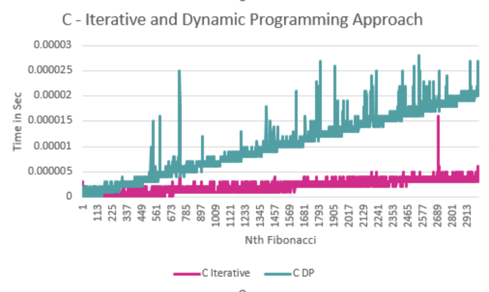
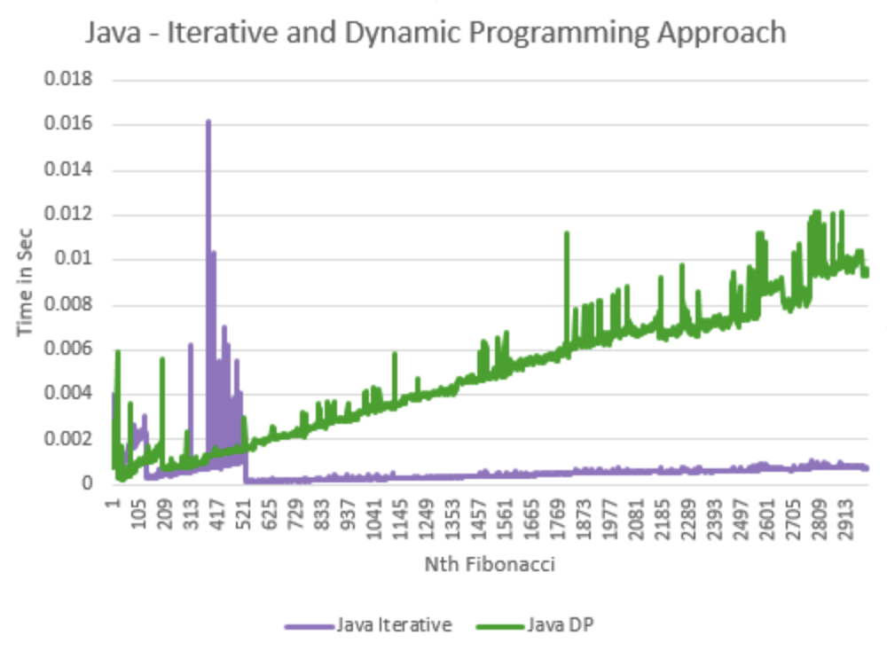

[](https://classroom.github.com/a/kdfTwECC)
# Midterm p1: Report on Analysis of Fibonacci Algorithm
* **Author**: Aliya Salmanova
* **Semester** Fall 2025
* **Languages Used**: C, Java

## Overview and Big O Notation

Pseudocode for iterative approach:
```
//set up prev, curr
//loop to n
//assign curr to array[i]
//curr becomes prev + curr, prev becomes old curr which is now array[i]
//return array[n]
```

The time complexity for the iterative approach is O(n). Here are the steps:
1. I first declared and assigned values to 2 variables. We can count this as O(2).
2. Then I looped to n by incrementing i. O(n).
3. I did some reassigning in the loop. I reassigned an array element and the initial 2 variables. O(n + 3).
5. We returned the nth element.

So, the T(n) in this algorithm exactly the way I solved it in C is
T(n) = 4n + 2

We don't count the constants, so the Big O Notation is O(n).

The space complexity is O(1), as no matter how large or small n is, we always declare 2 variables.


Pseudocode for recursive approach:
```
//base case (which checks if value is 1 or less)
//find prev 2 values through recursive calls and add them. assign that to array[n] 
//we need a return as function returns an int
```

The time complexity for the iterative approach is O(n^2). Here are the steps:
1. Check if base case is met. If so, return.
2. If base case was not met, we have to find the previous 2 values through recursive calls.
2. Step 1-2 are repeated until we have n-1 layers, according to our recurrence tree.

So is n is 4, our recurrence tree would show:
n
n/2 n/2 (2^1)
n/4 n/4 n/4 n/4 (2^2)
n/8 n/8 n/8 n/8 n/8 n/8 n/8 n/8 (2^3)

So our time complexity would be O(2^n-1), but we ignore constants, so are left with O(2^n),
which is exponential growth.

Our space complexity would be O(n). This is because the space complexity of a recursive algorithm
is the space for the data structures used + the depth of the recursion.
This is because we count how many calls are on the call stack, and the amount of calls on the call
stack never goes over n.
In the case of n = 4, we would get fib(4), fib(3), fib(2), fib(1) on the call stack.
After that, fib(1) gets popped off and fib(0) would be placed on the call stack.
We never go over 4 functions on the call stack.

Pseudocode for dynamic programming approach:

```
//base case
//dynamic programming: if array[n] is not zero, it has already been calculated so return value
//find prev 2 values through recursive calls and add them. assign that to array[n] 
//we need a return as function returns an int
```

The big O notation for the dynamic programming solution is O(n). Here are the steps:
1. Check if the base case is met (if n is 1 or less). If so, return.
2. If not, check if we have already saved/calculated fibonacci of n. If so, we can just return it.
3. If base is not met and fib(n) has not already been calculated and saved, return fib(n - 1) + fib(n - 2),
   as the result fibonacci of n is the addition of the fibonacci of the 2 numbers that come before it.

Here are the computations we will be making in this solution according to the recurrence tree:

n
n/2
n/4
n/8 n/8

To show what is happening better I will draw out a tree:
fib(4)
fib(3) fib(2) - returns
fib(2) fib(1) - returns
fib(1) fib(0)

So, the T(n) = n + C.
C in this case would be the calls that we are doing for the fib(n) that have already been calculated,
where we just return the already computed result. Since big O notation does not include constants,
or big O notation would be O(n).

The way I solved the problem, the space complexity would be the same as the space complexity as the
regular recursive solution. This is because in both cases, I already am passing in an array
filled with zeros. So, while dynamic programming solutions normally take up more space,
this one will not as I am simply checking if the fib(n) has already been calculated by checking
if array[n] is still 0 or if it is filled. So, the space complexity for this solution is also O(n),
as during the calculation of fib(1), there would be n amount of calls on the call stack.

## Empirical Data & Discussion

For empirical data, I let the recursive function run until n = 50, as I saw that the Java code would give me problems for the recursive function for larger n numbers on my operating system.
The iterative and dynamic programming solutions ran until n = 3000.
I wrote separate Runner code in C and Java to print out the data to the csv files. These languages both deal with time in different ways,
so it was important to make sure that the time would be measured in the same units, or else our data and comparisons would be incorrect.


### Operations Comparison

#### Operations Count

| N    | Iterative | Recursive | Dynamic Programming |
|------|-----------|-----------|---------------------|
| 3    | 4         | 1         | 1                   |
| 4    | 5         | 2         | 2                   |
| 5    | 6         | 4         | 3                   |
| 6    | 7         | 7         | 4                   |
| 7    | 8         | 12        | 5                   |
| 8    | 9         | 20        | 6                   |
| 9    | 10        | 33        | 7                   |
| 10   | 11        | 54        | 8                   |
| 11   | 12        | 88        | 9                   |
| 12   | 13        | 143       | 10                  |
| 13   | 14        | 232       | 11                  |
| 14   | 15        | 376       | 12                  |
| 15   | 16        | 609       | 13                  |
| 16   | 17        | 986       | 14                  |
| 17   | 18        | 1596      | 15                  |
| 18   | 19        | 2583      | 16                  |
| 19   | 20        | 4180      | 17                  |
| 20   | 21        | 6764      | 18                  |
| 21   | 22        | 10945     | 19                  |
| 22   | 23        | 17710     | 20                  |
| 23   | 24        | 28656     | 21                  |
| 24   | 25        | 46367     | 22                  |
| 25   | 26        | 75024     | 23                  |
| 26   | 27        | 121392    | 24                  |
| 27   | 28        | 196417    | 25                  |
| 28   | 29        | 317810    | 26                  |
| 29   | 30        | 514228    | 27                  |
| 30   | 31        | 832039    | 28                  |
| 31   | 32        | 1346268   | 29                  |
| 32   | 33        | 2178308   | 30                  |
| 33   | 34        | 3524577   | 31                  |
| 34   | 35        | 5702886   | 32                  |
| 35   | 36        | 9227464   | 33                  |
| 36   | 37        | 14930351  | 34                  |
| 37   | 38        | 24157816  | 35                  |
| 38   | 39        | 39088168  | 36                  |
| 39   | 40        | 63245985  | 37                  |
| 40   | 41        | 102334154 | 38                  |

You can see the iterative and dynamic solutions have a similar operations count, and the recursive approach's operations
become significantly larger.

The results we get also depends on what we count as an operation, meaning where we are incrementing the operations count.
In the dynamic programming solution, we are not incrementing the operations count when the function is being called for the n
where fib of n has already been calculated and just returning a value from our array. If we were, it would count as more operations.


### Recursive Versions
```c```


```java```


### Iterative and Dynamic Programming Versions
```c```


```java```



### Speed Comparison Between Languages

As we can see in the line graphs, the recursive version in Java is more costly than the version in C, and in general
all the runtimes of the different approaches are more costly than the runtimes in C.


## Language Analysis

### Language 1: C

Like in the Java implementation, the recursive approach in C proves to be very inefficient in terms of runtime.
The C implementation of the dynamic programming approach results in worse runtimes than the iterative approach.
The iterative approach's runtimes are surprisingly good.
The drawbacks of dynamic in programming in this case is that calloc is a costly function, as it takes time for the program
to allocate n amount of memory, and initiate all the elements to 0. The bigger n, the more space the array needs,
and the longer it takes C to allocate that memory. Another drawback for the dynamic programming approach is that,
for n values that have already been calculated, we still need to recursively call the function again,
and check whether we already have the array[n] value. This takes time and adds on to the callstack.


### Language 2: Java

For the dynamic programming solution, I was concerned about whether the array would be passed as a copy when used as an argument in the helper function.
However, since arrays are stored in the heap in Java, what gets copied is the pointer. So, the array can be mutated in place.

Java is an object-oriented programming language, so I had to think in terms of classes and create objects. To make it possible
to create an array of the different Fibonacci objects, I had to implement a FibonacciApproach interface and have the Fibonacci
objects all implement that interface, so that I could later loop through the array of objects and call the fibonacci() method on all of them.
This had me think in a different way than I do in C coding.

However, the implementation of the algorithm itself is nearly identical in both languages. In the dynamic programming one however,
I did not need a helper method in java. I implemented the helper method in c so that the fibonacciRecursiveDynamic() method
would remain with 2 arguments like the other two approaches, and the helper method could take in the array as an extra argument.
This was not necessary in Java as I saved the array of n size as a property of the object.


### Comparison and Discussion Between Experiences

In general, I find programming languages to work similarly, especially when implementing stand-alone algorithms,
versus using the languages to create some kind of application.
What was most different in terms of the coding itself is how I had to take care of memory manually in C and deal with addresses and pointers,
and how in Java I had to use object-oriented programming.

I noticed there was more of a difference between what I had to do in the runner and main files to get the code to run similarly
in both languages and have the same outputs and prompts (for example, main in Java can't just return a 1 to start over, etc).
It also took a lot of time to make sure the time functions in both languages work in the same way, as these languages have their
own libraries and built-in functions for this. Another thing I had to use different libraries for was writing to the csv files.
In the future I'd like to run the functions for both languages in the same file - perhaps I'd use python for this.

Through examining the runtime data, I learned more about the JVM transpiles. I did not expect Java to run slower than C,
but it's important to note that I did do optimization when I compiled in C. However, C runs after it is completely compiled,
whereas Java is both a compiled language and transpiled language, so the compiler only compiles to byte-code, and then the
byte code is transpiled by the JVM. It makes sense that that would give somewhat of a disadvantage. I also realize that
under the hood garbage collection takes some power for the program to carry out.

Before doing this assignment, I automatically thought that C would run slower as it is older and I assumed that more modern
programs would just be built with better optimization and resources. However, this theory was just part of my imagination and
did not include facts about how these languages are actually run.

Another point I want to make is that I noticed that the dp solution in Java takes a shorter amount of time than the iterative
solution in Java, yet the iterative approach in C takes less time than the dynamic programming solution in C. Since we know
that calloc takes some time to perform in C, I figure that this shows that creating an array of size n in C with using calloc,
is heavier than instantiating an array of size n in Java.

In general, these comparisons are nuanced and even can depend on how you compiled your code in C. When there are small differences
it becomes difficult to spot the 'culprit' of these differences as there are many differences in what is happening under the hood
between two languages. However, I'm sure there are instances where one language can clearly outperform another for very
clear reasons, while in other cases the differences are more vague.

## Conclusions / Reflection

In conclusion, the recursive version, especially without dynamic programming, is just comparatively very slow and unoptimized.
If I were building an application, I wouldn't want to use this approach instead of the other two.
The iterative approach is the fastest, which is surprising as we always hear the fibonacci algorithm being associated with
dynamic programming. It also has the same big o notation as the iterative, so at first glance one would think that it would at least
not be slower than the iterative. However, the dynamic approach includes trying to get the results of n values we've already found,
which causes less runtime as the recursive version of course as we are just returning an already calculating number from an array,
but it still takes up space on the callstack and it does take some time. In the C implementation, the function calloc takes up
more time than malloc, as calloc makes sure all the values are initiated to 0. This was necessary as we check whether the fiboancci of
a certain n number was already calculated by seeing if array[n] is 0 or not, but it does take extra runtime to call calloc.

If I could go back in time and redo the assignment, besides starting extra early, I would have written the 'print to csv' code
in only one language and would have run functions from both languages in that code. However, time did not permit me to go back
and figure this out, so the best thing I could do was to make sure the time_functions print as accurately, meaning the same format and units
in both languages. A downfall of this way is that running the time function also possibly could take some time before getting the time result,
hence producing slight inaccuracies in our comparisons.

Also, I wrote these solutions completely by myself, as that is what I thought is the right way to complete assignments and practice coding.
However, I realize I probably could've investigated better solutions from the internet and chosen if I would rather use a different
implementation, rather than what I could come up with originally.

Another thing that I got confused about is whether I should populate an array with the fibonacci numbers up to number N as well as
return the nth fibonacci from each function. This would allow me to use the printIntArray function after each fibonacci function call.
However, this led to each function having two purposes, which leads to confusion, bigger runtimes as we'd have to set elements of the array,

Also, as a side effect of this assignment, I learned some math, what the e in 1e6 or 1e9 (etc) means, what nanoseconds are,
and practiced converting seconds to milliseconds and small tasks like this.

## References

https://www.w3schools.com/java/java_files_write.asp
https://www.tutorialspoint.com/java/lang/system_nanotime.htm
https://www.tutorialspoint.com/cprogramming/c_function_pointers.htm
https://www.geeksforgeeks.org/dsa/program-for-nth-fibonacci-number/ 


